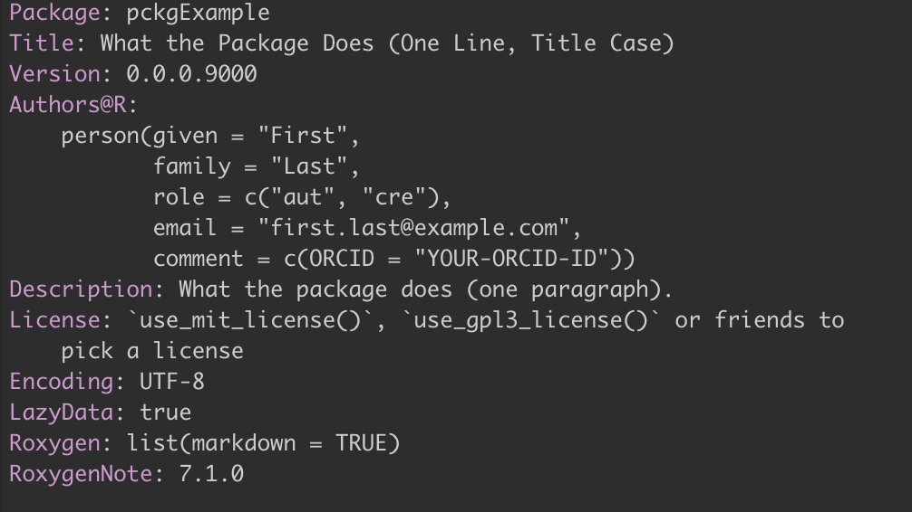
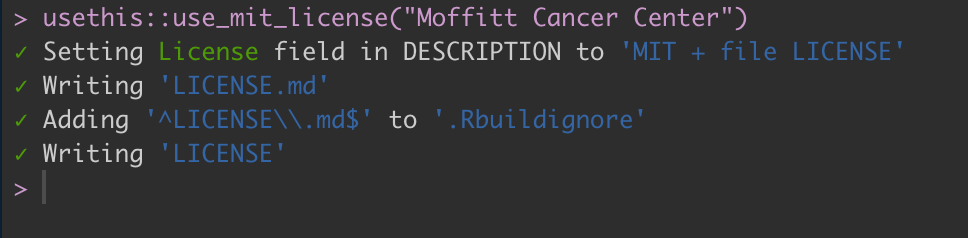
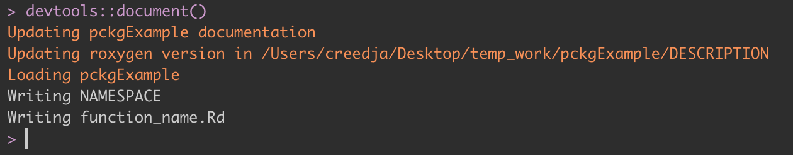
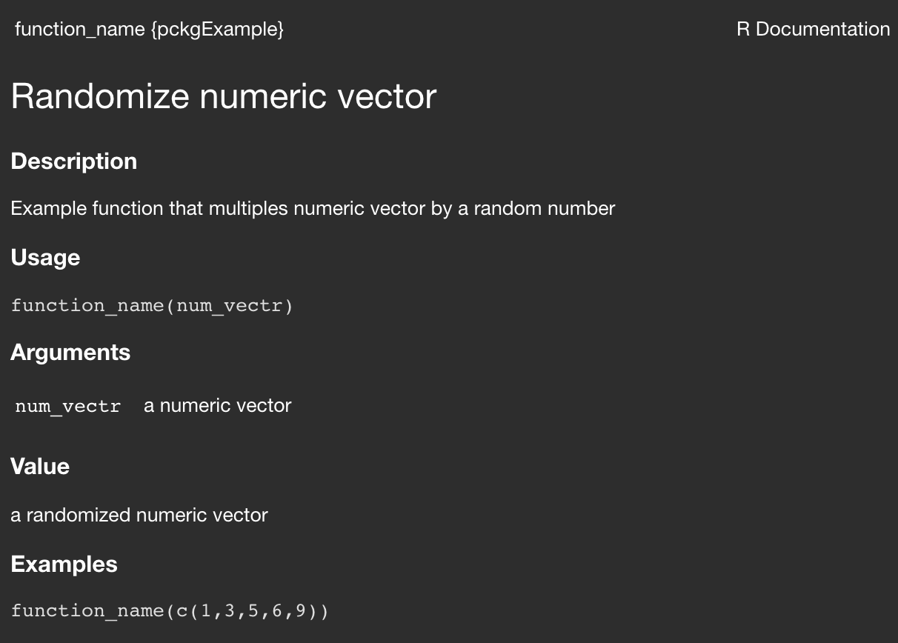
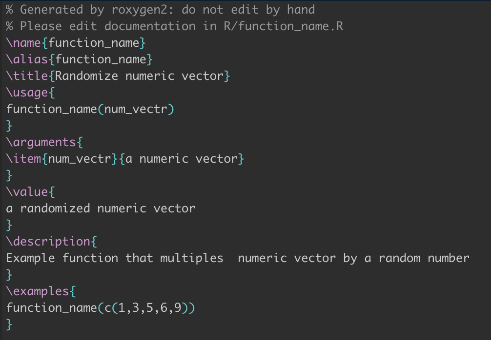
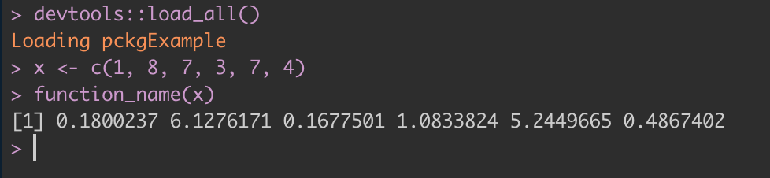
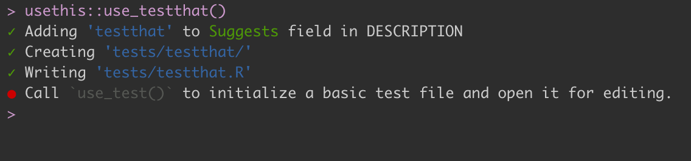
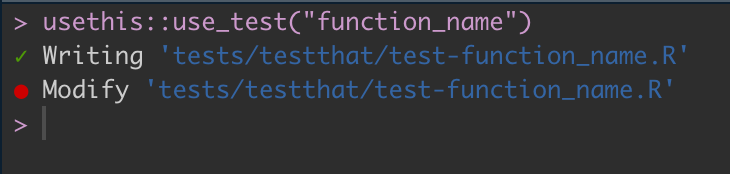
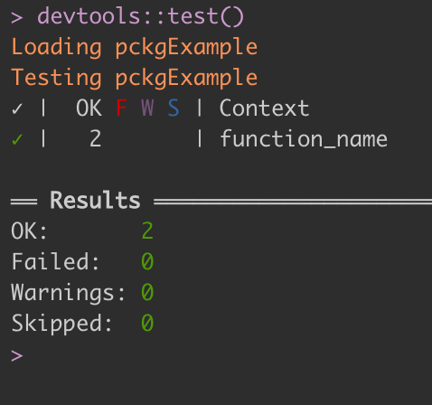
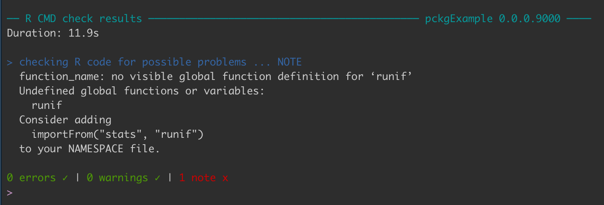

```{r xaringan-themer, include = FALSE}
library(xaringanthemer)
duo_accent(primary_color = "#B668F7", secondary_color = "#F9850A")
```

```{r setup, include=FALSE}
knitr::opts_chunk$set(
  fig.width = 10, fig.height = 6, fig.retina = 2,
  warning = FALSE, message = FALSE
)

xaringanExtra::use_xaringan_extra(c("animate_css", "text_poster", "panelset"))
xaringanExtra::use_tachyons()
```

class: center middle hide-count hide-logo

<div class="talk-logo"></div>

.talk-meta[
  .talk-title[# Building R packages <br> .smaller[]]

  .talk-author[Jordan Creed]
  
  .talk-date[ @jhcreed]
]


---

## Why build an R package? 

Packages are the basis of reproducible code in the R environment. 

Contain: 
+ code
+ data
+ documentation
+ tests

Even if you are just writing the package for yourself, following the 
conventions/structure associated with R packages can help you save time 
and standardization across projects. 

`r emo::ji("fire")` .accent-blue[Anything that can be automated should be automated]

---

## Getting started 

.accent-blue[devtools] is a suite of functions that automate common steps in 
the package development process
+ cornerstone of modern package development
+ the basis of the [R packages](https://r-pkgs.org/) book

.accent-blue[usethis] is a workflow package to help with common recurring
steps during projects 

```{r, echo=TRUE, eval=FALSE}

library(devtools)
library(usethis)
library(tidyverse)

```

---

## Step 1: Create package skeleton

```{r, echo=TRUE, eval=FALSE}

usethis::create_package("path/to/pckgExample")

```


`usethis::create_package()` and `devtools::create()` creates a basic skeleton
of the R package. This includes creating the following: 
+ R project 
+ R folder - contains `.R` files for all the functions
+ DESCRIPTION file - contains metadata
+ NAMESPACE - declares functions to export
+ .gitignore - files not to be uploaded to GitHub
+ .Rbuildignore - files not to be included when compiling the package

---

## Step 2: Writing functions

```{r, echo=TRUE, eval=FALSE}

usethis::use_r("function_name")

```

`use_r()` creates a new `.R` file of the same name for writing a new function, 
with the same name. The `.R` file should contain only one exportable function. 
It should .accent-blue[NOT] contain any top-level code (ex: `library(devtools)`)

```{r, echo=TRUE, eval=FALSE}
function_name <- function(num_vectr){
  x <- num_vectr*(runif(length(num_vectr)))
  return(x)
}
```

---

## Step 3: Update DESCRIPTION

Edit the `Title`, `Authors@R`, and `Description` by hand and save.

.h-center.w-70[

]

---

## Step 4: Add license

`usethis` has multiple built in licenses including: CCO, MIT, Apache 2.0, GPL v3, 
AGPL v3, LGPL v3, and CCBY 4.0. The most common are MIT and GPL v3. 

```{r, echo = TRUE, eval = FALSE}

usethis::use_mit_license("Moffitt Cancer Center")

```

.h-center[

]

---

## Step 5: Add documentation

`Code > Insert Roxygen Skeleton` 

`roxygen` comments are specially formatted comments (starting with `#'`). They
are then converted into a `man/function_name.Rd` file. This is triggered by adding
the `roxygen` comments at the top of the file, saving, and running 
`devtools::document()`. 

```
#' Randomize numeric vector
#'
#' Example function that multiples  numeric vector by a random number
#'
#' @param num_vectr a numeric vector
#'
#' @return a randomized numeric vector
#' @export
#'
#' @examples
#' function_name(c(1,3,5,6,9))
function_name <- function(num_vectr){
  x <- num_vectr*(runif(length(num_vectr)))
  return(x)
}
```

```
devtools::document()
```

---

## Step 5: Add documentation

.w-50.h-center[

]

.w-50.h-center[

]

---

## Step 5: Add documentation - NAMESPACE

NAMESPACE is what ensures that your package works well with other packages and 
is self-contained. It is also .accent-blue[required] if you plan to submit to 
CRAN. This is where you specify `imports` and `exports`. `imports` define how 
functions in other packages find one another, while `exports` define what 
functions are available outside of the package. 

`r emo::ji("fire")` .accent-blue[Never edit a NAMESPACE file by hand]

.w-50.h-center[

]
---

## Step 6: Seeing how the function works 

`load_all` makes the functions availble for local testing, however it is not 
available in the global workspace. Simulates building, installing and attaching
a package (i.e. `library(pckgExample)`). 

.w-70.h-center[

]

---

## Step 7: Building tests

Formal testing ensures that your code does what it is suppose to do. The 
`testthat` package helps with writing unit tests and can be initiated using
`usethis::usetestthat()`. This adds `Suggests: testthat` to the `DESCRIPTION`
file, and creates the `tests/testthat` directory and adds the `test/testthat.R`
file. To write a test call `usethis::use_test()`.

.w-50.h-center[

]

.w-50.h-center[

]

---

## Step 7: Building tests

Tests should be broken down into single elements and you should be able to 
narrow down what went wrong based on the output. `testthat` tests are made up
of three elements: .accent-blue[expectations] - what is the expected result
of this computation/task, the a.ccent-blue[test] - multiple expectations working
together to examine elements of a single function, and the .accent-blue[file] - collection
of related tests. 

`r emo::ji("fire")` .accent-blue[It is better to have a lot of small tests than a few big tests]

```{r, echo=TRUE, eval=FALSE}

# inside tests/testthat/test-function_name.R

test_that("basic behavior is correct", {
  x <- c(1,3,5,7)
  expect_equal(length(function_name(x)), 4)
  expect_condition(function_name(NA), NA)
})

```

---

## Step 7: Building tests

.w-70.h-center[

]

---

## Step 8: Check

```{r, echo=TRUE, eval=FALSE}

devtools::check()

```

`devtools::check()` runs `R CMD check`, the gold standard for checking that 
an R package is in working order, from within the R. 

.w-70.h-center[

]

---

## Using other packages

When using functions/objects from other packages you need to explicitly declare 
them in your code by using the `::` symbols and add them to your imports 

```{r, echo = TRUE, eval = FALSE}
function_name <- function(num_vectr){
  x <- num_vectr*(stats::runif(length(num_vectr)))
  return(x)
}
```

```

usethis::use_package("stats")
✓ Adding 'stats' to Imports field in DESCRIPTION
● Refer to functions with `stats::fun()`

```

---

## Vignettes

.accent-blue[Vignettes] are long form documentation for packages. These provide
more complete documentation than in help files or examples and often include 
information on the purpose of your package and how to use it within normal
workflows. 

```{echo = TRUE, eval = FALSE}

usethis::use_vignette("example-vignette")
✓ Adding 'knitr' to Suggests field in DESCRIPTION
✓ Setting VignetteBuilder field in DESCRIPTION to 'knitr'
✓ Adding 'inst/doc' to '.gitignore'
✓ Creating 'vignettes/'
✓ Adding '*.html', '*.R' to 'vignettes/.gitignore'
✓ Adding 'rmarkdown' to Suggests field in DESCRIPTION
✓ Writing 'vignettes/example-vignette.Rmd'
● Modify 'vignettes/example-vignette.Rmd'

```

---

## Data

Data can be included with your package and should be stored as `.RData` files 
in the `data/` folder. 

```{r, echo = TRUE, eval=FALSE}

x <- c(1,5,7,3,4)
usethis::use_data(x)

```

Within `usethis::use_data()`, there is an `internal=TRUE` argument that is for 
pre-computed data that is utilized by the package. Data stored this way will be 
located in `R/sysdata.rda`

`r emo::ji("fire")` .accent-blue[Data does not need to be exported but it should be documented]

```{css, echo=FALSE}
.talk-logo {
  width: 980px;
  height: 453px;
  position: absolute;
  top: 3%;
  left: 10%;
  background-image: url('figures/code_comic.png');
  background-size: cover;
  background-repeat: no-repeat;
}
.talk-meta {
  #font-family: Overpass;
  position: absolute;
  text-align: left;
  bottom: 10px;
  left: 25px;
}
.talk-author {
  color: #444;
  font-weight: bold;
  font-size: 1.5em;
  line-height: 1em;
}
.talk-date {
  color: #666;
  font-size: 1.25em;
  line-height: 0;
}
.hide-count .remark-slide-number {
  display: none;
}

# sizing 
.w-50 {
  width: 50%;
}
.w-25 {
  width: 25%;
}
.w-40 {
  width: 40%;
}
.w-75 {
  width: 75%;
}
.w-70 {
  width: 70%;
}
.w-115 {
  width: 115%;
}
.w-150 {
  width: 150%;
}
.h-center {
  margin: 0 auto;
}
.top-0    { top:    0; }
.right-0  { right:  0; }
.bottom-0 { bottom: 0; }
.left-0   { left:   0; }

# colors

.accent-other { 
  color: light brilliant orange,
}
.accent-purple { 
  color: #b668f7; 
}
.accent-blue { 
  color: #00bfff ;
}
.accent-orange{
  color: #f9850a ;
}

.blank { 
  color: white ;
}


.dramatic p {
  font-size: 145px;
  color: #f9850a ;
  margin-top: 0;
  margin-bottom: 0;
}

```


